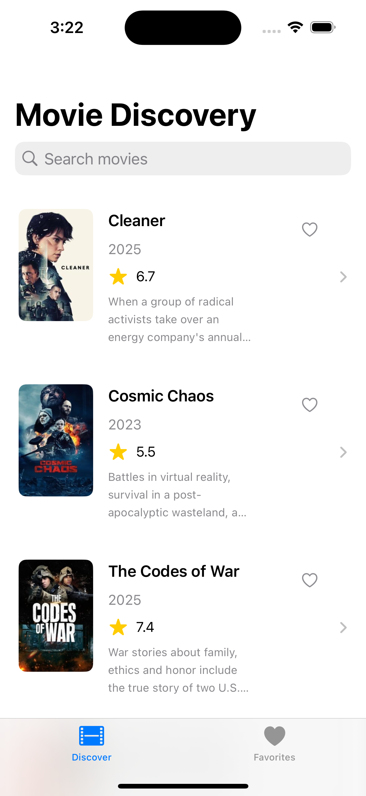
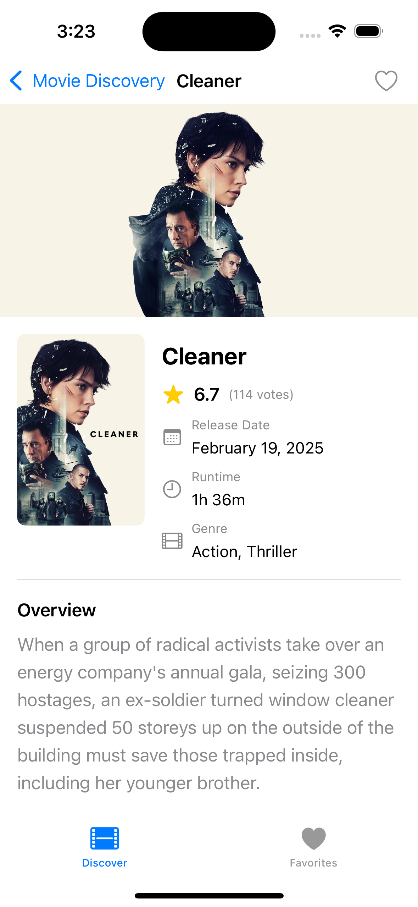
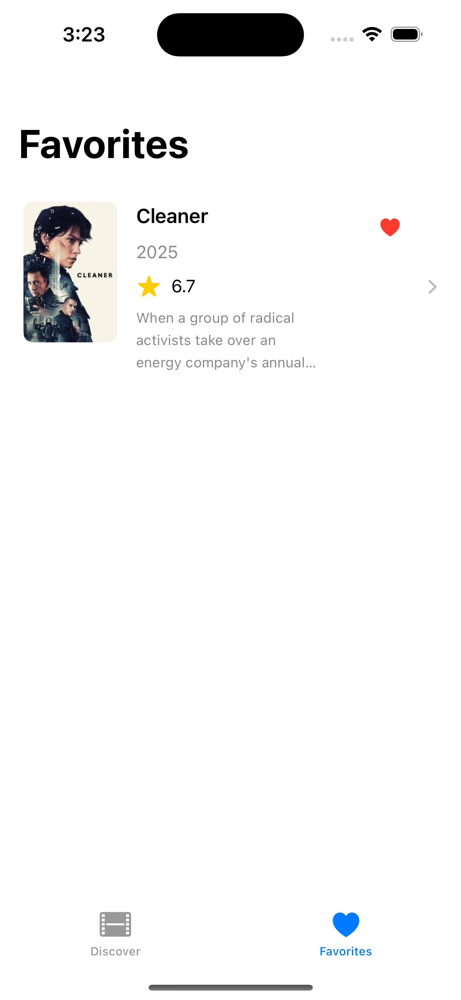

# Movie Discovery App

A SwiftUI application that fetches and displays movies from The Movie Database (TMDB) API, allowing users to search for movies, view details, and save favorites.

## Features

### Main Features
- **Movie List Screen**: Displays a list of movies from TMDB with poster, title, and release year
- **Search Functionality**: Allows users to search for movies dynamically with debounced input
- **Movie Detail Screen**: Shows comprehensive movie details including poster, backdrop, overview, release date, rating, and genres
- **Error Handling**: Graceful error handling with user-friendly error messages
- **Loading States**: Visual indicators during data fetching

### Bonus Features
- **Favorites System**: Users can mark movies as favorites and access them in a dedicated tab
- **Image Caching**: Efficient image loading with caching
- **Offline Support**: Basic offline functionality to access previously loaded content

## Screenshots

<table>
  <tr>
    <td></td>
    <td></td>
    <td></td>
  </tr>
  <tr>
    <td align="center">Movie List</td>
    <td align="center">Movie Detail</td>
    <td align="center">Favorites</td>
  </tr>
</table>

## Architecture

This project follows the MVVM (Model-View-ViewModel) architecture pattern:

- **Models**: Data models representing movie information
- **Views**: SwiftUI views for displaying the UI
- **ViewModels**: Logic for fetching data and managing state

### Key Components

1. **MovieAPIClient**: Handles API communication with TMDB
   - Provides both Combine publishers and async/await implementations
   - Manages request creation and response parsing

2. **ViewModels**:
   - **MovieListViewModel**: Manages fetching and filtering movie lists
   - **MovieDetailViewModel**: Handles loading detailed movie information

3. **SwiftUI Views**:
   - Reactive UI that updates based on view model state
   - Clean separation between UI and business logic

4. **Utilities**:
   - **FavoritesManager**: Handles saving and retrieving favorite movies
   - **OfflineStorageManager**: Provides caching for offline access

## Project Structure

```
MovieDiscovery/
├── App/
│   ├── MovieDiscoveryApp.swift
│   └── MainTabView.swift
├── Models/
│   └── MovieModels.swift
├── Views/
│   ├── MovieListView.swift
│   ├── MovieDetailView.swift
│   └── FavoritesView.swift
├── ViewModels/
│   ├── MovieListViewModel.swift
│   └── MovieDetailViewModel.swift
├── Networking/
│   └── MovieAPIClient.swift
├── Utils/
    ├── FavoritesManager.swift
    └── OfflineStorage.swift

```

## Setup Instructions

1. Clone the repository
```bash
git clone https://github.com/yourusername/movie-discovery.git
cd movie-discovery
```

2. Open the project in Xcode
```bash
open MovieDiscovery.xcodeproj
```

3. Install dependencies (if using Swift Package Manager)
```bash
swift package resolve
```

4. Build and run the application

## API Integration

This app uses The Movie Database (TMDB) API. To use the app:

1. Register for an API key at [themoviedb.org](https://www.themoviedb.org/documentation/api)
2. Add your API key in the `MovieAPIClient.swift` file:

```swift
private let apiKey = "YOUR_API_KEY_HERE"
```

The app uses the following endpoints:
- Movie List: `https://api.themoviedb.org/3/discover/movie`
- Movie Search: `https://api.themoviedb.org/3/search/movie`
- Movie Details: `https://api.themoviedb.org/3/movie/{id}`

## Testing

### Running Tests

To run the tests:
1. In Xcode, select the test navigator tab
2. Click the play button next to the test target or individual test classes
3. Or use the keyboard shortcut: ⌘U

### Test Implementation

The project includes unit tests for the ViewModels. Here's a sample implementation of the `MovieListViewModelTests`:

```swift
import XCTest
import Combine
@testable import MovieDiscovery

class MockMovieAPIClient: MovieAPIClient {
    var mockMovieResponse = MovieResponse(
        page: 1,
        results: [
            Movie(
                id: 1,
                title: "Test Movie",
                overview: "This is a test movie",
                posterPath: "/test.jpg",
                releaseDate: "2023-01-01",
                voteAverage: 7.5
            )
        ],
        totalPages: 1,
        totalResults: 1
    )
    
    var shouldFail = false
    var error: APIError = .invalidResponse
    
    override func fetchMovies() -> AnyPublisher<MovieResponse, APIError> {
        if shouldFail {
            return Fail(error: error).eraseToAnyPublisher()
        } else {
            return Just(mockMovieResponse)
                .setFailureType(to: APIError.self)
                .eraseToAnyPublisher()
        }
    }
    
    override func searchMovies(query: String) -> AnyPublisher<MovieResponse, APIError> {
        if shouldFail {
            return Fail(error: error).eraseToAnyPublisher()
        } else {
            return Just(mockMovieResponse)
                .setFailureType(to: APIError.self)
                .eraseToAnyPublisher()
        }
    }
}

class MovieListViewModelTests: XCTestCase {
    var viewModel: MovieListViewModel!
    var mockAPIClient: MockMovieAPIClient!
    var cancellables: Set<AnyCancellable>!

    override func setUp() {
        super.setUp()
        mockAPIClient = MockMovieAPIClient()
        viewModel = MovieListViewModel(apiClient: mockAPIClient)
        cancellables = []
    }

    override func tearDown() {
        viewModel = nil
        mockAPIClient = nil
        cancellables = nil
        super.tearDown()
    }

    func testFetchMoviesSuccess() {
        // Given
        let expectation = XCTestExpectation(description: "Movies loaded successfully")
        
        // When
        viewModel.$state
            .dropFirst() // Skip the initial .idle state
            .sink { state in
                if case .loaded(let movies) = state {
                    XCTAssertEqual(movies.count, 1)
                    XCTAssertEqual(movies.first?.title, "Test Movie")
                    expectation.fulfill()
                }
            }
            .store(in: &cancellables)
        
        viewModel.fetchMovies()
        
        // Then
        wait(for: [expectation], timeout: 1.0)
    }
    
    func testFetchMoviesFailure() {
        // Given
        let expectation = XCTestExpectation(description: "Error when loading movies")
        mockAPIClient.shouldFail = true
        mockAPIClient.error = .networkError(NSError(domain: "test", code: 404, userInfo: nil))
        
        // When
        viewModel.$state
            .dropFirst() // Skip the initial .idle state
            .sink { state in
                if case .error(let message) = state {
                    XCTAssertTrue(message.contains("Network error"))
                    expectation.fulfill()
                }
            }
            .store(in: &cancellables)
        
        viewModel.fetchMovies()
        
        // Then
        wait(for: [expectation], timeout: 1.0)
    }
}
```

## Requirements

- iOS 15.0+
- Xcode 13.0+
- Swift 5.5+

## License

This project is licensed under the MIT License - see the LICENSE file for details.

## Acknowledgements

- [The Movie Database (TMDB)](https://www.themoviedb.org/) for providing the API
- [SwiftUI](https://developer.apple.com/xcode/swiftui/) for the UI framework
- [Combine](https://developer.apple.com/documentation/combine) for reactive programming
